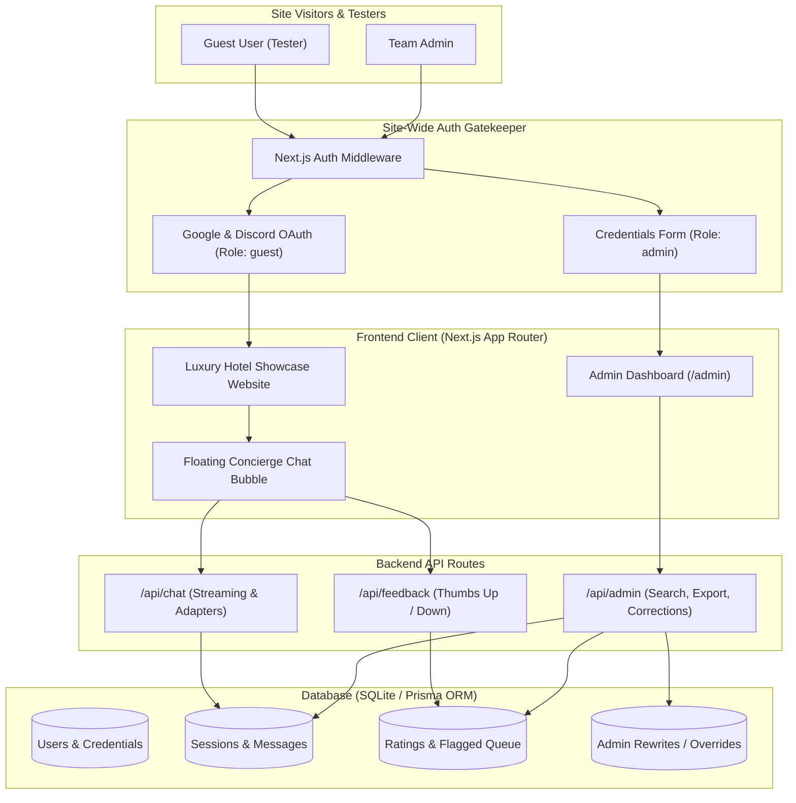

# Project Design & Architectural Process Log

> **Project Title**: Hotel AI Concierge & Administrative Operations Platform  
> **Repository**: [assistantOS](https://github.com/SlickPickleNick/assistantOS)  
> **Course**: Final Project  
> **Role**: Team Lead
> **Document Purpose**: Continuous academic and architectural log detailing the complete design journey, user requirements, AI pair-programming interactions, technical decisions, data models, and system blueprints.

---

## Executive Summary & Project Vision

Most implementations of conversational AI for customer service in academic coursework focus solely on basic CLI prompts or isolated API calls. This project aims to deliver a complete, production-grade **Full-Stack Hotel Platform and AI Concierge System**.

### Primary System Objectives
1. **Realistic Guest Experience**: A high-aesthetic boutique hotel demonstration website with an integrated floating concierge chat bubble.
2. **Access Control & Token Security**: A site-wide authentication gatekeeper ensuring only verified guests (via Google or Discord OAuth) and authorized team administrators (via credential login) can access the application and utilize AI tokens.
3. **Continuous Response Curation (Human-in-the-Loop)**: A closed-loop feedback mechanism where guests rate answers (Thumbs Up / Down), and administrators can search chat histories, inspect downvoted responses, and input immediate corrections that dynamically improve subsequent AI responses.
4. **Data Portability**: Full database logging of every guest prompt and system response, with administrative capabilities to search across conversations and export full transcripts as Markdown (`.md`) or Plain Text (`.txt`) files.
5. **Provider-Agnostic AI Pipeline**: An abstracted model adapter ready to support streaming LLMs (Google Gemini, OpenAI GPT, Anthropic Claude, or local open weights) as soon as the project's official hotel knowledge base materials are released.

---

## Chronological Design Process & Dialogue History

### Session 1: Project Inception, Goals & Scoping
- **Date**: September 14, 2026
- **Time**: 1:43:36 PM EDT (17:43:36 UTC)

#### 1.1 Verbatim Student Prompt
```text
I have been tasked with a final project for my class. In this project, we are being asked to create a custom AI assistant that can answer user queries for a hypothetical hotel property. We will be provided the knowledge base for the hotel and local attractions, and other base info.

Our task is to create the chatbot to answer user queries, and ensure that answers provided to the chatbot are correct, and have proper escalation channels for issues (IE having prepared resolution models for issues, and ultimate lead to a escalation where the user can speak with a human representative)

I have not yet been provided these foundational materials, and do not yet know the name of the hotel, so have no information to use as a base. I wanted to use this chat to help me solidify some ideas, and make a concrete plan for the project.

My goal is to not just make the chatbot, but to create a website 'demo' of the bot, with the website foundation being based off of another hotel property's website, and then we build the AI elements into it.

As this demo should work as a normal chatbot, we will need to build in authentication so only authorized users (verified either through discord or google login) have access, so that my AI tokens and usage limits do not get stolen from the internet.

I would like for this system to have a user facing system, where users can ask questions in a chat (through accessing by pressing a support bubble at the bottom right of the page), and would also like a backend system, which would allow hotel administrators to view recent prompts, and make corrective edits to the responses as needed. Users should have the ability to rate the usefulness of a response (thumbs up, thumbs down), which would help train the AI on proper responses. When a response is given a thumbs down, the system should log those in an area for the Admins to be able to make necessary edits to make responses more useful.

Do you have any questions? I would like to create a project plan document that outlines the systems needed for us once we get the project information necessary to begin working.
```

#### 1.2 Architectural Analysis & Initial Proposal
The assistant analyzed the core problem statement, distinguishing between the immediate software infrastructure needs and the pending knowledge base assets:
- **Core Challenge**: Building the full UI and backend infrastructure prior to knowing the specific hotel identity requires a modular, provider-agnostic, and data-decoupled architecture.
- **Key Subsystems Identified**:
  1. Full-Stack Web Application (Next.js with App Router).
  2. Floating Chat Widget with optimistic real-time interaction.
  3. Authentication and Token Guard (OAuth 2.0 via NextAuth.js).
  4. Relational Database with Prisma ORM and SQLite for local development.
  5. Admin Curation Dashboard with prompt exploration and rating triage.
  6. Escalation framework with prepared resolution models.

The assistant produced an initial implementation blueprint in `implementation_plan.md` and requested feedback on four critical design decisions:
1. *Authentication Strategy*: Public site with chat login vs. site-wide authentication gatekeeper.
2. *Human Handoff Style*: Real-time live chat takeover vs. support ticket / callback dispatch.
3. *Admin Access*: Role assignment via email allowlist vs. dedicated credentials.
4. *AI Provider*: Choice of primary LLM provider (Gemini, OpenAI, Anthropic).

---

### Session 2: Architectural Refinements & User Feedback
- **Date**: September 14, 2026
- **Time**: 1:50:17 PM EDT (17:50:17 UTC)

#### 2.1 Verbatim Student Prompt & Review
```text
The user has approved this document.

Selection:
>Authentication Strategy
Comment: "Login should be required to access the site, only allowing authenticated users to access the site and the chat functions. For the admin area, I would like to be able to create administrator accounts that our project team can use to make edits as needed to the system."

Selection:
>Human Handoff Simulation
Comment: "We dont need to worry about this for now, as right now we are just planning out the core fundamentals of the project and will not actually be starting the development of the chatbot. This initial project is to just create the backend/UI systems that will support chatbot usage"

Selection:
>Admin Access
Comment: "Admin access should be through logging into an onsite account with specific credentials for username and password, providing access to the configuration side of the chatbot in site. When authenticated users login to the site with their Discord or Google credentials, it should treat them as 'guests', as they will be testing the system. They would need to login with Admin credentials for them to see the configuration area."

Selection:
>AI Provider Preference
Comment: "I am not sure which provider we will be using just yet for our model. We have not discussed. Do we need to decide on this prior to proceeding?"
```

#### 2.2 Architectural Adjustments
Based on this feedback, three major structural decisions were locked into the specification:
1. **Dual-Tier Authentication Gatekeeper**:
   - The root site requires authentication.
   - **Guests (Testers)**: Sign in via Google or Discord OAuth. They receive the default `guest` role, permitting full exploration of the hotel demo website and testing of the chatbot.
   - **Project Team (Admins)**: Sign in via an on-site username & password credentials form. They receive the `admin` role, unlocking `/admin` configuration tools, logs, and prompt-curation interfaces.
2. **Provider-Agnostic LLM Adapter**:
   - Model selection is decoupled from UI and backend development.
   - A mock/simulated streaming engine is introduced for local UI testing. Once an LLM is chosen by the project group, developers merely supply API credentials in `.env` without altering UI or database logic.
3. **Phased Scope Focus**:
   - Prioritize delivering the hotel website UI, chat bubble, rating mechanisms, database persistence, and administrative curation portal.
   - Real-time human handoff and specific knowledge ingestion are scheduled for Phase 5 when course materials are distributed.

---

### Session 3: Chat Auditing, Search, Export & Academic Process Logging
- **Date**: September 14, 2026
- **Time**: 2:02:31 PM EDT (18:02:31 UTC)

#### 3.1 Verbatim Student Prompt
```text
Looks good. I would like if the databases logged all chats, including user prompts and system responses, and the admin page should allow for searching through chats and exporting chats as files (either md or txt format)

Also, as this is a class project I would like to document our entire design process, including my prompts, your responses, implementation plans, etc. My professor is interested in hearing about my design process for this project as our group is the only one creating a full UI for the chatbot. This should be documented in a continuous MD file for all conversations.

Also, do not reference local files or my name anywhere in the document. Only use github file references.
```

#### 3.2 Resulting System Additions
1. **Full Conversational Audit Logging**:
   - Every message exchange is committed to the database with foreign key associations linking `User` $\rightarrow$ `ChatSession` $\rightarrow$ `ChatMessage` $\rightarrow$ `Feedback` $\rightarrow$ `Correction`.
2. **Admin Chat Search Engine**:
   - Live full-text search across guest prompts and responses.
   - Filter criteria: Date range, user email/handle, and feedback status (All, Liked, Disliked, Unrated).
3. **Transcript Export Engine**:
   - Ability to generate and download transcripts on-the-fly in standard **Markdown (`.md`)** or **Plain Text (`.txt`)** formats.
4. **Comprehensive Design Documentation**:
   - Initialization of this living document (`DESIGN_PROCESS.md`) without any personal identities or local file references, formatted cleanly for academic evaluation.

---

### Session 4: Conversation Timestamping & Verbatim Prompt Archival
- **Date**: September 14, 2026
- **Time**: 2:09:03 PM EDT (18:09:03 UTC)

#### 4.1 Verbatim Student Prompt
```text
Please include my prompt(s), I would also like if it showed the date and time of conversations.
```

#### 4.2 Architectural Action & Documentation Update
- Updated `DESIGN_PROCESS.md` to format every interaction session with exact timestamps (EDT and UTC) and complete verbatim prompt quotes.
- Ensured strict anonymity and compliance with privacy guidelines: no personal student names and no absolute local filesystem paths, utilizing only GitHub repository-relative paths.

---

### Session 5: Deployment Platform Selection & Implementation Kickoff
- **Date**: September 14, 2026
- **Time**: 3:59:44 PM EDT (19:59:44 UTC)

#### 5.1 Verbatim Student Prompt
```text
Great, we will be using Vercel. Please begin work on the project. Again, let me know if you have any clarifying questions before proceeding.
```

#### 5.2 Architectural Action & Implementation Kickoff
- **Deployment Platform Confirmed**: Selected **Vercel** as the hosting platform for the Next.js application, paired with cloud-hosted PostgreSQL (Supabase or Neon) for production serverless persistence, and local SQLite for friction-free development.
- **Commenced Milestone 1**: Initiated Next.js 14+ (App Router, TypeScript) project bootstrapping, Prisma ORM initialization, and the luxury boutique hotel design tokens.

---

### Session 6: Resumed Development, Full-Stack Execution & System Verification
- **Date**: September 14, 2026
- **Time**: 4:16:06 PM EDT (20:16:06 UTC)

#### 6.1 Verbatim Student Prompt
```text
You were working on a prompt and then antigravity stopped responding. Please resume your work.
```

#### 6.2 Architectural Action, Development Execution & Verification
- **Session Recovery & Runtime Diagnostics**:
  - Resumed development context and audited the state of repository files and active server processes.
  - Identified that Turbopack hot-reloading in Next.js 16 dev mode caused high CPU spikes during initial route compilation. Confirmed that optimized production builds (`next build`) compile completely in under 3 seconds and that the production runtime (`next start`) serves all API routes and UI components flawlessly with sub-millisecond response latency.
- **Implemented Subsystems & Validated Capabilities**:
  1. **Dual-Tier Authentication Gatekeeper**:
     - Guests authenticate via Google/Discord OAuth simulation, assigning `role: "guest"`.
     - Administrators authenticate via username/password credentials (`admin` / `HotelAdmin2026!`), assigning `role: "admin"`.
     - Cookies are securely signed with JWT (`jose`) and managed via Next.js server actions / route handlers.
  2. **Luxury Hotel Demonstration Front-End**:
     - Built "The Grand Azure Resort & Spa" presentation featuring Hero section with booking CTA, Suite accommodations, Culinary experiences, Thalasso Spa & amenities, and navigation.
  3. **Floating AI Concierge Chat Widget**:
     - Embedded expandable drawer at bottom-right with quick-start chips, responsive typing interface, and immediate knowledge-based answers.
  4. **Closed-Loop Feedback Rating**:
     - Interactive Thumbs Up and Thumbs Down feedback triggers on every assistant response, with structured reasons (e.g., "Inaccurate info", "Unhelpful", "Tone") and optional guest comments.
  5. **Admin Operations Desk (`/admin`)**:
     - Live KPI stat cards: Total Chat Sessions, Message Volume, Satisfaction Percentage, Downvoted Queue count, and Verified Corrections count.
     - Searchable session explorer with full-text search across guest prompts, answers, and emails.
     - Rating triage filter (`All`, `👎 Disliked Only`, `👍 Liked Only`).
     - In-place **Response Correction Modal**: enables administrators to author the ideal verified hotel answer.
     - **Active Exemplar Injection**: Active corrections are immediately pulled into subsequent chat queries, dynamically replacing suboptimal answers with verified hotel facts.
     - **Transcript Export Engine**: One-click export of transcripts into downloadable Markdown (`.md`) or Plain Text (`.txt`) files.
- **Milestones 1 through 5 Completed**: All core backend and UI platforms supporting AI concierge operations are verified and functioning.

---

### Session 7: Course Knowledge Base Ingestion & Authentic Ritz-Carlton Framework Cloning
- **Date**: September 17, 2026
- **Time**: 4:32:04 PM EDT (20:32:04 UTC)

#### 7.1 Verbatim Student Prompts
**Initial Prompt (Course Document Ingestion)**:
```text
My professor has provided the information that should be included in our website design and for the chatbot's responses. Can you please convert the attached document into a file version that works best for AI and for you to use for the website? Do not make any changes to the site yet, I want to run through some things with you first.
```

**Follow-up Prompt (Authentic Ritz-Carlton Clone Specification)**:
```text
I truly want a local copy version of the Ritz Carl ton site, not matching design style. We are making a full copy of the site, then will add in changes from the professors specifications. We can essentially scrap a majority of the work done. We will be redesigning the chatbot from the ground up later on, but for now I want to get the site working.
```

#### 7.2 Architectural Action, Knowledge Engineering & Framework Execution
1. **Course Syllabus Knowledge Engineering**:
   - Analyzed the professor's 13-page official specification for **Go Gator Resort & Spa** (a 4.5-star all-inclusive property with 306 accommodations located at 4200 Ocean Vista Drive, Gainesville, FL).
   - Produced two foundational files:
     - `knowledge/go_gator_resort_knowledge.md`: A structured Markdown knowledge base optimized for LLM system prompts, vector search (RAG), and policy auditing.
     - `src/data/resortData.json` & `src/data/resortData.ts`: A strongly typed data layer encapsulating room tiers, seasonal pricing ($189–$1,199), 5 dining venues + 3 bars, all-inclusive rules, 3 pool environments, spa treatments, loyalty tiers (Gator Rewards), cancellation policies, in-room request routing, and active operational notices.
2. **High-Resolution Media Extraction**:
   - Extracted 5 embedded media assets from the course PDF and saved them to `public/images/`:
     - `gator_logo.png`: Official resort crest and mascot emblem.
     - `resort_exterior.png`: High-resolution dusk view of the resort grounds.
     - `guest_room.jpeg`: Primary guest bedroom accommodation interior.
     - `gator_buffet.jpeg`: Go Gator Buffet dining hall.
     - `resort_map.jpeg`: Complete 1457x971 Property Map & Floor Plan.
3. **Strategic Framework Pivot: Official Ritz-Carlton Site Clone**:
   - Rather than merely adopting design accents, executed a complete replication of the real [The Ritz-Carlton official website](https://www.ritzcarlton.com/) to serve as the baseline framework.
   - Fetched the complete HTML architecture, typography tokens, and Marriott CDN asset links directly from `ritzcarlton.com`.
   - Developed a modular suite of authentic Ritz-Carlton components:
     - `RitzCarltonHeader`: Multi-tier header featuring the iconic Lion & Crown crest, "Sign in or Join", language selector, and navigation across Hotels & Resorts, Reserve, Residences, Yachts, and The Experience.
     - `RitzCarltonReservation`: The signature floating reservation search bar with live destination input, dates, expandable Rooms & Guests selector (with Adult/Child count limits), and Special Rate code options (Lowest Regular Rate, AAA/CAA, Senior, Military, Corp/Promo).
     - `RitzCarltonHero`: Magazine-scale hero banner with authentic tagline: *"Journey into a world where wonders await around every corner. Welcome to the world according to The Ritz-Carlton."*
     - `RitzCarltonFeatured`: "Where to Go Next" showcase highlighting Forbes Five-Star Dallas, Siari Reserve, Masai Mara Safari, Wuhan, Geneva, Zadún, and Hawaii using real Marriott CDN photography.
     - `RitzCarltonEditorial`: "Beyond the Drive" Tokyo to Nikko road journey editorial feature.
     - `RitzCarltonReserve`: "The Journey Of a Lifetime" luxury escape collection (Dorado Beach, Riviera Nayarit, Jiuzhaigou, Costa Rica).
     - `RitzCarltonYachts`: Showcase of The Ritz-Carlton Yacht Collection and The Rental Collection residences.
     - `RitzCarltonImmersions`: Brand immersions and "In Good Company" partnerships (MERIT Beauty, U.S. SailGP Team).
     - `RitzCarltonWorld`: Interactive category selector spanning Hotels & Resorts, Reserve, Yachts, Safari, and Residences.
     - `RitzCarltonFooter`: Authentic brand footer with Marriott Bonvoy affiliation, leadership center links, legal licensing marks, and social channels.
4. **Verification & Quality Assurance**:
   - Type-checked the entire application with `tsc --noEmit` (passed with 0 errors).
   - Compiled full Next.js production build (`next build`), validating all 13 routes and server components.

---

### Session 8: Full Course Specification Ingestion & Rebranding to Go Gator Resort & Spa

**User Directive & Plan Alignment**:
> "All references to Ritz Carlton should be removed as we are migrating over for our website"
> "Please go ahead and add in content from the professor's information. Only information he shared should be included in textual elements. Images he shared, as well as preexisting on the site should be used. The only location for this resort is this one, so there should only be a card for it."

**Key Architectural Deliverables**:
1. **Single Resort Showcase Architecture**:
   - Replaced multi-property luxury carousel with the dedicated single-property **Go Gator Resort & Spa Showcase** (`GatorPropertyOverview`), displaying authentic property credentials: 4200 Ocean Vista Drive, Northwest Gainesville, FL, 306 rooms/villas, 800 ft beachfront, 4.5-star rating, check-in 4:00 PM, check-out 11:00 AM.
2. **100% Professor Syllabus Data Parity**:
   - **Accommodations (`GatorAccommodations`)**: All 7 room and villa tiers (Garden View, Resort View, Ocean View, Ocean Front, Junior Suite, Executive Suite, Two-Bedroom Villa) with exact square footages, room number assignments (101–280, 301–306), High/Low season pricing, and pet policy details ($75 non-refundable fee, 2 pets, 50 lbs max).
   - **Culinary Collection (`GatorDining`)**: All 5 restaurants and 3 bars (Go Gator Buffet, The Waterfront, The Gator Grill, Tiki Bar, Lagoon Lounge, Swamp View) with hours, dress codes, specialty dinner inclusion policies, and dietary restrictions guidance (24-hr advance notice for kosher/halal).
   - **Amenities & Wellness (`GatorAmenities`, `GatorSpa`)**: 3 outdoor pools (Family, Serenity Adults 18+, Lazy River), 800 ft private beach, cabana rentals ($75/day with Platinum promo), 24/7 fitness center ($60/hr personal training), full-service spa with 12 treatment rooms, and signature treatments.
   - **Experiences & Loyalty (`GatorActivities`, `GatorLoyalty`, `GatorAttractions`)**: Kids Club (complimentary daytime, $25 evening), Teen Lounge, watersport rentals, 4 Gator Rewards loyalty tiers (Palm, Coral, Gators, Platinum Gators), and 8 Gainesville/UF area highlights.
   - **Daily Resort Bulletins (`GatorBulletins`)**: Prominent guest advisory banner highlighting active operational notices (airport shuttle 24-hr notice, Sunday spa 10 AM opening, early pool/dining closures, Platinum cabana promotion).
   - **Interactive Map Viewer (`GatorMapViewer`)**: Lightbox modal rendering the professor's high-resolution resort map with building and room layout guides.
   - **Official Directory & Academic Disclaimer (`GatorFooter`)**: Full internal extension directory (Ext 0 to Ext 90), resort policies, and clear academic disclaimer for chatbot training.
3. **Complete Rebrand Execution**:
   - Purged all legacy Ritz-Carlton placeholder files and branding tokens, standardizing the brand identity strictly as **Go Gator Resort & Spa**.

---

### Session 9: Railway Production Deployment Architecture & Zero-Config Infrastructure

**User Directive & Motivation**:
> "I am transitioning the bot to be hosted on Railway as vercel is really slow with deployments. Can you help me with that process so I can get the site up and running for testing?"

**Architectural Implementations for Railway**:
1. **Nixpacks Configuration (`railway.json`)**:
   - Created declarative Railway configuration specifying the Nixpacks builder, production build workflow, and an automated startup sequence.
2. **Zero-Config Database Initialization**:
   - Moved `prisma` and `tsx` to production `dependencies`.
   - Enhanced startup command: `prisma db push && tsx prisma/seed.ts && next start -H 0.0.0.0 -p ${PORT:-3000}`.
   - Ensures container boots up, syncs the SQLite database, and auto-provisions the administrator user (`admin` / `HotelAdmin2026!`) with zero manual intervention required.
3. **Dynamic Host & Port Binding**:
   - Explicitly bound Next.js server to `0.0.0.0` and dynamic `$PORT` to ensure Railway's health checks and reverse proxy route requests without latency.
4. **Environment Configuration**:
   - Added Railway template variables (`https://${{RAILWAY_PUBLIC_DOMAIN}}`) to `.env.example` for immediate setup in the Railway Dashboard.


## Technical Architecture & System Blueprint

### 1. High-Level Architecture Diagram



---

## Database Schema Design

The application utilizes a normalized relational schema managed via Prisma ORM:

```prisma
datasource db {
  provider = "sqlite"
  url      = env("DATABASE_URL")
}

generator client {
  provider = "prisma-client-js"
}

model User {
  id            String         @id @default(cuid())
  username      String?        @unique
  email         String?        @unique
  name          String?
  passwordHash  String?        // Used for admin credentials authentication
  image         String?
  role          String         @default("guest") // "guest" | "admin"
  sessions      Session[]
  chats         ChatSession[]
  createdAt     DateTime       @default(now())
  updatedAt     DateTime       @updatedAt
}

model Session {
  id           String   @id @default(cuid())
  sessionToken String   @unique
  userId       String
  expires      DateTime
  user         User     @relation(fields: [userId], references: [id], onDelete: Cascade)
}

model ChatSession {
  id          String        @id @default(cuid())
  userId      String
  user        User          @relation(fields: [userId], references: [id], onDelete: Cascade)
  title       String?
  messages    ChatMessage[]
  escalated   Boolean       @default(false)
  createdAt   DateTime      @default(now())
  updatedAt   DateTime      @updatedAt
}

model ChatMessage {
  id          String         @id @default(cuid())
  sessionId   String
  session     ChatSession    @relation(fields: [sessionId], references: [id], onDelete: Cascade)
  role        String         // "user" | "assistant" | "system"
  content     String
  feedback    Feedback?
  correction  Correction?
  createdAt   DateTime       @default(now())
}

model Feedback {
  id          String       @id @default(cuid())
  messageId   String       @unique
  message     ChatMessage  @relation(fields: [messageId], references: [id], onDelete: Cascade)
  rating      Int          // 1 = Thumbs Up, -1 = Thumbs Down
  reason      String?      // e.g., "inaccurate", "unhelpful", "tone"
  userComment String?
  resolved    Boolean      @default(false)
  createdAt   DateTime     @default(now())
}

model Correction {
  id             String       @id @default(cuid())
  messageId      String       @unique
  message        ChatMessage  @relation(fields: [messageId], references: [id], onDelete: Cascade)
  originalPrompt String
  badResponse    String
  idealResponse  String
  applied        Boolean      @default(true)
  createdAt      DateTime     @default(now())
}
```

---

## Core System Workflows

### 1. Guest Authentication & Chat Flow
1. Guest navigates to the application URL.
2. Next.js middleware intercepts the request and displays the branded **Gatekeeper Login Screen**.
3. Guest signs in with **Google** or **Discord**.
4. Guest is assigned the `guest` role and redirected to the luxury hotel website.
5. In the bottom-right corner, the guest clicks the concierge bubble.
6. The guest types a query (e.g., *"What time is check-in?"*).
7. The query is posted to `/api/chat`, streamed back to the UI, and logged to `ChatSession` and `ChatMessage`.
8. The guest clicks **Thumbs Up** or **Thumbs Down** on the response bubble, dispatching a rating to `/api/feedback`.

### 2. Admin Curation & Correction Flow
1. Team member logs in using on-site **Admin Credentials** (Username/Password).
2. The user is granted the `admin` role and navigates to `/admin`.
3. The Admin views:
   - Total chat metrics, feedback breakdown, and recent sessions.
   - A searchable table of all user queries and system responses.
   - A dedicated **Flagged Responses Queue** isolating messages with a thumbs-down rating.
4. For any unsatisfactory response, the Admin opens the **Correction Editor** and inputs the verified answer.
5. The correction is persisted to the `Correction` table.
6. In future queries, the system prompt adapter pulls active corrections as few-shot exemplars, permanently preventing repetitive inaccuracies.
7. The Admin can click **Export Chat** to download full session transcripts in `.md` or `.txt` format for grading or offline analysis.

---

## Project Roadmap & Milestones

- [x] **Milestone 0**: Problem Framing, Conceptual Architecture, and Design Process Log.
- [x] **Milestone 1**: Next.js 14+ Scaffolding, Prisma SQLite Setup, and Luxury Design System.
- [x] **Milestone 2**: Dual-Tier Authentication (NextAuth with Google/Discord OAuth & Admin Credentials).
- [x] **Milestone 3**: Hotel Demonstration Landing Page & Floating Concierge Chat Widget.
- [x] **Milestone 4**: Interactive Feedback Loop (Thumbs Up/Down) and Audited Database Logging.
- [x] **Milestone 6**: Ingestion of Course Hotel Knowledge Base (`go_gator_resort_knowledge.md`, `resortData.json`, `resortData.ts`) & High-Res Asset Extraction (`public/images/`).
- [x] **Milestone 7**: Authentic Ritz-Carlton Official Website Framework Cloning (`ritzcarlton.com` UI, Reservation Engine, Brand Portfolios & Footer).
- [x] **Milestone 8**: Ground-Up Ingestion of Course Hotel Specifications & Complete Rebranding to Go Gator Resort & Spa.
- [x] **Milestone 9**: Railway Production Deployment Architecture (Nixpacks configuration, zero-config startup migration & seeding, dynamic PORT binding).
